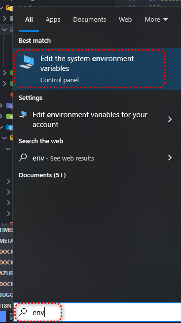
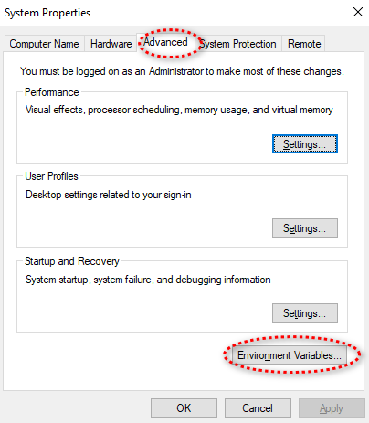
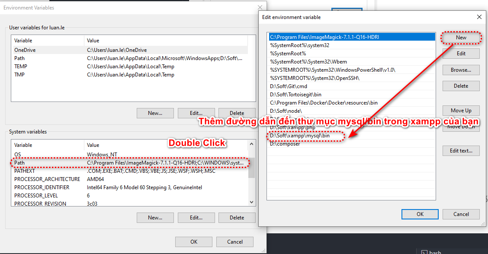

<p align="center"><a href="https://laravel.com" target="_blank"></a></p>

<p align="center">
<a href="https://github.com/laravel/framework/actions"></a>
<a href="https://packagist.org/packages/laravel/framework"></a>
<a href="https://packagist.org/packages/laravel/framework"></a>
<a href="https://packagist.org/packages/laravel/framework"></a>
</p>

### Hướng dẫn cài đặt

**Bước 1: Cài đặt các gói phụ thuộc và config source**
Để khởi chạy source này trước tiên bạn cần copy `.env.example` thành `.env` và sửa lại các config theo mong muốn, đặc biệt là config mysql.

Tiếp theo hãy cài đặt composer, tạo key cho project và cache lại các config.

Bạn có thể làm các điều này hoặc chạy file `install.sh` để chúng được thực hiện tự động.

```shell
sh install.sh
```

**Bước 2: Tạo cơ sở dữ liệu mẫu**

Trước khi khởi chạy demo bạn cần kết nối nó với một cơ sở dữ liệu mysql.
Có 2 cách làm là tự thay đổi các file config hoặc sử dụng file sh được chuẩn bị sẵn. Mục đích cuối cần đạt ở bước này là làm được các yêu cầu sau:

-   Tạo mới database `ecommerceadvlara` trong mysql
-   Chạy file sql mới nhất trong thư mục `/database/scripts` để tạo mới các table và data trong database vừa mới tạo
-   Sau khi chạy xong hãy kiểm tra lại đã có data hay chưa

Nếu muốn bạn có thể chạy tự động file `database.sh` bằng cách sao chép `.env.example` thành `.env` rồi config lại file `.env` cho đúng với cấu hình database bạn muốn, sau đó chạy

```shell
sh database.sh
```

Trong quá trình chạy có thể của sổ lệnh sẽ hỏi mật khẩu, bạn hãy dùng mật khẩu mysql account, tránh nhầm với mật khẩu máy tính.

Database sẽ tự động được thêm và sau khi hoàn tất lệnh.

Nếu bạn gặp lỗi `mysql command not found` bạn có thể tạo database bằng tay và import toàn bộ databasee trong thư file: `database\scripts\runner.sql`

Hoặc bạn có thể fix lỗi `mysql command not found` bằng cách thêm path mysql vào danh sách path:

Cách làm: Tìm ứng dụng tên như ảnh sau:


Chọn Advanced > Environment Variables


Thêm path mysql


Tắt git bash hoặc cmd đang mở và thử chạy lại `sh database.sh`

**Bước 3: Cấu hình lại file `.env`**

-   Thay đổi cấu hình kết nối database
-   Thay đổi `APP_URL` bằng `APP_URL` trên máy tính của bạn, nếu không config chính xác chỗ này sẽ gây ra lỗi ở các link tài nguyên, đặc biệt là link image.

Ví dụ : `http://localhost/aptech-laravel-ecommerce-demo/public`.

Bạn vào link truy cập của mình như một ứng dụng PHP bình thường và sử dụng mật khẩu để truy cập

**Home** (Sử dụng đường dẫn `...public/`)

**Admin Login Details** (Sử dụng đường dẫn `...public/login`)

```shell
Email : admin@gmail.com
Password: admin@gmail.com
```

**Customer Login Details** (Sử dụng đường dẫn `...public/user/login`)

```shell
Email : customer@mail.com
Password: customer@mail.com
```

**Bước 5 Đổi lại `php.validate.executablePath` trong file `.vscode/settings.json `cho phù hợp với máy của bạn**

Ví dụ: `"php.validate.executablePath": "D:/Soft/xampp/php/php.exe", `

**Bước 6: Cấu hình cho các extension hỗ trợ**
Theo dõi: [Link](https://ourcodeworld.com/articles/read/349/how-to-install-and-enable-the-imagick-extension-in-xampp-for-windows)

Nếu bạn dùng window thì hãy tải các bản cài đặt dll và thêm config cho file `php.ini` như sau:

```ini
;;;;;;;;;;;;;;;;;;;;;;
; Dynamic Extensions ;
;;;;;;;;;;;;;;;;;;;;;;
; Add the following line where the other extensions are loaded
imagick.skip_version_check=true
extension=php_imagick.dll
upload_tmp_dir = c:\laragon\tmpsD:\Soft\xampp\temp
```

**Bước 7: Cấu hình cho package**
Kiểm tra trong composer.json bạn sẽ thấy có 2 package là: `unisharp/laravel-filemanager` và `intervention/image-laravel`. Đây là 2 gói hỗ trợ quản lý file hình ảnh. Bạn có thể đọc tài liệu trực tiếp tại: [Laravel File Manager](https://unisharp.github.io/laravel-filemanager) và [Intervention Image](https://github.com/Intervention/image)

Trong phần này bạn chỉ cần chạy lệnh:

```shell
sh laravel-filemanager.sh
```

Sau khi cài đặt xong bạn thử vào một màn hình bất kỳ có tính năng chọn hình ảnh để upload. Ví dụ: `.../public/admin/banner/creates`

> Nếu muốn tìm hiểu thêm về cách sử dụng các gói này bạn có thể chủ động tạo các project demo và thao tác thử theo hướng dẫn của trang chủ.

> Lưu ý nếu gặp một số lỗi sau thì đây sẽ là cách xử lý dành cho bạn

> Lỗi `Failed to open stream: Permission denied` do không có quyền truy cập các file trong `storage` hoặc `public`.

```shell
// Chạy lại các lệnh phân quyền và run lại config:
chmod -R gu+w storage
chmod -R guo+w storage
php artisan cache:clear

// Nếu các lệnh trên chưa phân quyền hết thì hãy dùng tiếp các lệnh sau:
php artisan cache:clear
composer dump-autoload
sudo chmod -R 777 storage/*
sudo chmod -R 777 storage/logs/*
sudo chmod -R 775 bootstrap/cache
php artisan config:cache

// Sau khi thực hiện có thể khởi động lại Apache
```
